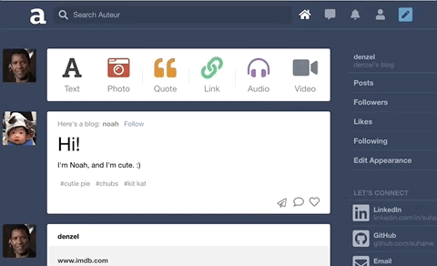

# Auteur

[Auteur](https://auteur-nodejs.herokuapp.com)

Auteur is a full-stack web application inspired by Tumblr. It utilizes Node.js on the backend, a MongoDB database, and React.js with a Redux architectural framework on the frontend.

## Features and Implementation

### Single Page
Auteur is a single page app that allows for quick navigation between its various components. As data is fetched from NodeJS, components are only updated when necessary.

### Posts
To keep code DRY, leveraged Higher Order Components and component composition to render different types of posts and new/edit forms. 


Incorporated AWS SDK to upload images to AWS S3 and persist image data to MongoDB


### Notes (Likes and Comments)
On the backend, designed a polymorphic and extensible MongoDB schema for different note types such as likes and comments. 



### Following Blogs

Integrated React and CSS3 keyframes to animate page elements and improve user experience.


### Tags and Search

Built a search feature with a popover that suggests hashtags ranked by popularity. Integrated React and CSS3 Flexbox to accomplish a ‘masonry’ layout for search results.


### Chat

Leveraged WebSockets to implement the chat feature. 


Implemented online indicator. 


### Responsive Layout

Enabled selective rendering and responsive layout for mobile devices via CSS media query.


### Design Patterns

- Designed modular React components & normalized Redux state for a seamless single page experience.
- Used React Context to pass global data to nested components without manually threading props.
```javascript
// global_context_provider.jsx
export const GlobalContext = React.createContext(null);

class GlobalContextProvider extends React.Component {
  constructor(props) {
    super(props);
  }

  render() {
    const { children, currentUser } = this.props;
    return (
      <GlobalContext.Provider
        value={{
          currentUser,
        }} >
        {children}
      </GlobalContext.Provider>
    );
  }
}
```

```javascript
// deeply nested component
import { GlobalContext } from '../../global_ context_provider';

class PostShowItem extends React.Component {
  renderPostContent() {
    const { currentUser } = this.context;

    if (!currentUser.following.includes(blog._id)) {
      // suggest user to follow blog
    }
  }
}

PostShowItem.contextType = GlobalContext;
```

- Utilized Promises to simplify async code and minimize 'callback hell' on the NodeJS back-end.

```javascript
// posts.js - API endpoint to create new post
router.post('/posts',
  middleware.isLoggedIn,
  upload.array('newFiles'), 
  function (req, res) {
    // STEP 1 - find blog
    modelQuery.findOneBlog(req.params.id)
      .then((foundBlog) => {
        let postBody = lodash.merge({}, req.body);
        // ...
        // STEP 2 - add tags to post
        return modelQuery.addTagsToPost(postBody, foundBlog);
      })
      .then(({ post, blog }) => {
        let newPost = new Post(post);
        // STEP 3a - if a media post, upload files to AWS
        if (['photo', 'video', 'audio'].includes(newPost.type)) {
          // ...
          return mediaUtil.uploadFiles(req.files, newPost, blog);
        }
        // STEP 3b - if not a media post, pass on to the next 'then' block
        return { post: newPost, blog: blog };
      })
      .then(({ post, blog }) => { 
        // ...
        // STEP 4 - save the new post
        return post.save()
      })
      .then((post) => {
        // STEP 5 - include post's tags 
        return post.populate({ path: 'tags', select: 'label' })
          .execPopulate();
      })
      .then((post) => {
        // STEP 6 - send http reponse json
        return res.json(post);
      })
      // STEP 7 - handle error(s)
      .catch((err) => res.status(422).json([err.message]));
  });
```


### Future Directions

I am currently working on the following features: 
- In-app notifications
- Audio and video posts

